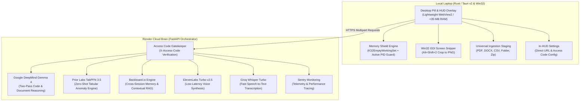

# PotatoClaw

*Featherweight desktop AI companion and Win32 anti-thrash memory shield for 8 GB RAM laptops.*

[](LICENSE)
[](https://github.com/IshekKhal/potatoclaw/releases)
[](https://potatoclaw-backend.onrender.com/health)
[](backend/tests)

---

## What It Is

PotatoClaw is a native Windows desktop overlay built in Rust (Tauri v2) that protects memory-constrained PCs from lockups and freezes. When multitasking across browser tabs, IDEs, lab manuals, and PDFs, physical memory usage spikes past 90%. Windows drops into hard pagefile thrashing, freezing the desktop. 

PotatoClaw addresses this with two components:
1. **A local Win32 memory shield**: A floating desktop pill widget. Clicking it invokes native `K32EmptyWorkingSet` with active foreground process protection and a 60+ process whitelist, releasing 1.7 GB to 3.5 GB of physical memory in 0.24 seconds without closing open applications or dropping unsaved work.
2. **An asynchronous cloud brain**: Heavy multimodal reasoning, screen snip OCR, tabular anomaly scanning, cross-session memory, and voice synthesis offload to a containerized FastAPI backend on Render. The local machine stays cool and draws under 35 MB of resident RAM.

### Architecture Overview



---

## Download Standalone Binary

Pre-compiled standalone Windows executables are published on GitHub Releases:

**[Download latest potatoclaw.exe](https://github.com/IshekKhal/potatoclaw/releases)**

No installation wizard or administrative privileges required. Run `potatoclaw.exe`, open the HUD with `Alt+Shift+P`, click the gear icon to open **Settings**, and paste your backend URL and Access Code.

---

## Architecture & Core Modules

* [`src-tauri/src/memory_shield.rs`](src-tauri/src/memory_shield.rs): Win32 process status FFI. Scans running processes, resolves active foreground window PID via `GetForegroundWindow` and `GetWindowThreadProcessId`, filters against a 60+ process whitelist (`PROTECTED_PROCESS_NAMES`), skips kernel PIDs (PID 0, PID 4), and calls `K32EmptyWorkingSet` to flush idle background pages to the Windows standby list.
* [`src-tauri/src/screen_capture.rs`](src-tauri/src/screen_capture.rs): Win32 GDI screen snipper using `CreateCompatibleDC` and `BitBlt`. Writes cropped rectangles directly to disk without spawning third-party tools.
* [`src-tauri/src/network_gateway.rs`](src-tauri/src/network_gateway.rs): Native async reqwest client with recursive directory traversal (`scan_directory_to_text`), multi-document attachment staging, and Access Code security authentication.
* [`backend/app/services/gemma_brain.py`](backend/app/services/gemma_brain.py): Two-pass reasoning pipeline powered by Google DeepMind Gemma 4. Pass 1 generates explanations and code fixes; Pass 2 audits the answer against source errors to prevent hallucinations.
* [`backend/app/services/tabpfn_engine.py`](backend/app/services/tabpfn_engine.py): Tabular outlier engine using Prior Labs TabPFN. Ingests CSV or TSV data and detects statistical anomalies in milliseconds.
* [`backend/app/services/backboard_memory.py`](backend/app/services/backboard_memory.py): Server-side state and conversational context using Backboard.io with semantic recall query budgeting.
* [`backend/app/services/elevenlabs_voice.py`](backend/app/services/elevenlabs_voice.py): Audio streaming client using ElevenLabs Turbo v2.5 (George voice) for verbal summaries.
* [`backend/app/services/groq_stt.py`](backend/app/services/groq_stt.py): Fast speech transcription using Groq Whisper Large V3 Turbo.
* [`ui/`](ui/): Frontend assets. Pure HTML, CSS, and vanilla JavaScript with multi-source drag-and-drop support (VS Code tabs, Explorer files, web URLs) and in-HUD Settings modal.

---

## 1-Click Cloud Deployment (Render)

Deploy your own private PotatoClaw backend on Render's free tier:

[](https://render.com/deploy)

### Required Environment Variables

When deploying the blueprint on Render, configure these environment variables:

| Variable | Description | Where to get it |
|---|---|---|
| `GEMINI_API_KEY` | Google AI Studio API key for Gemma 4 reasoning | [Google AI Studio](https://aistudio.google.com/) |
| `TABPFN_API_KEY` | Prior Labs API key for tabular outlier detection | [Prior Labs](https://tabpfn.com/) |
| `BACKBOARD_API_KEY` | Backboard API key for assistant memory | [Backboard.io](https://backboard.io/) |
| `GROQ_API_KEY` | Groq API key for Whisper transcription | [Groq Console](https://console.groq.com/) |
| `ELEVENLABS_API_KEY` | ElevenLabs API key for voice synthesis | [ElevenLabs](https://elevenlabs.io/) |
| `SENTRY_DSN` | Sentry project DSN for telemetry (optional) | [Sentry](https://sentry.io/) |
| `ACCESS_CODE` | 6-digit numeric PIN securing your backend (e.g. `849201`) | Set by you |

Once deployed, Render gives you a public URL (e.g. `https://your-app.onrender.com`).

---

## Hotkeys & Desktop Controls

Registered natively via `tauri-plugin-global-shortcut`:

| Shortcut / Action | Target | Description |
|---|---|---|
| `Alt+Shift+P` | HUD | Toggle the assistant HUD window |
| `Alt+Shift+2` | Snipper | Activate full-screen crosshair to snip and stage a screen region |
| `Alt+Shift+1` | Clipboard | Pull clipboard text or image directly into the active prompt |
| `Alt+Shift+V` | Audio | Activate speech input via microphone |
| `Esc` | Snipper | Dismiss screen snipper without saving |
| Left-click pill | Pill | Toggle HUD visibility |
| Double-click pill | Pill | Trigger instant safe Win32 memory trim |
| Drag-and-drop onto pill or HUD | Drop Target | Stage PDF, DOCX, CSV, TSV, code, folders, or zip archives |

---

## Local Development Setup

### 1. Backend

```powershell
cd backend
python -m venv .venv
.\.venv\Scripts\Activate.ps1
pip install -r requirements.txt
cp ../.env.example .env

# Run local development server
uvicorn app.main:app --host 127.0.0.1 --port 8000 --reload
```

Run test suite:
```powershell
pytest tests/ -v
```

### 2. Desktop Client (Rust / Tauri v2)

Prerequisites: Rust stable (`rustup default stable`) and WebView2 (pre-installed on Windows 10/11).

```powershell
cd src-tauri

# Run client in development mode
cargo run

# Build release executable
cargo build --release
```

The compiled executable is written to `src-tauri/target/release/potatoclaw.exe`.

---

## Empirical Benchmark Results

Measured on an HP 15s (AMD Ryzen 3 3250U, 8 GB DDR4, 5.88 GB usable):

| Metric | Measured Value | Notes |
|---|---|---|
| Idle RAM Reclaimed | **1,719 MB** | Flushed to standby across background processes |
| Heavy Workload RAM Reclaimed | **3,500+ MB** | Measured with 14 Chrome tabs and VS Code open |
| Memory Trim Duration | **0.24 s** | Average scan and trim duration across all active PIDs |
| Standalone Binary Size | **18.3 MB** | Single executable with no external installer dependencies |
| Client Resident Memory | **< 35 MB** | Lightweight native footprint |
| Reasoning Latency (Two-Pass) | **680 ms - 920 ms** | Gemma 4 two-pass verification on Render |
| TabPFN Scan Latency | **178 ms** | Outlier detection on 50-row CSV test matrix |
| ElevenLabs Voice Response | **295 ms** | First audio chunk delivered via ElevenLabs Turbo v2.5 |
| Total Cost | **$0.00 / ₹0.00** | Operates entirely within verified free tiers |

---

## Verified Free-Tier Ledger

PotatoClaw operates entirely within permanent, verified free developer tiers:

| Component | Service | Tier | Monthly Cost |
|---|---|---|---|
| Desktop Client | Native Rust / Tauri v2 | Open Source (MIT) | $0.00 |
| Core Reasoning | Google DeepMind Gemma 4 | Google AI Studio Free Tier | $0.00 |
| Tabular Anomaly | Prior Labs TabPFN 3.5 | Developer Tier | $0.00 |
| Session Memory | Backboard.io | Developer Free Tier | $0.00 |
| Speech-to-Text | Groq Whisper Large V3 Turbo | Free Developer Tier | $0.00 |
| Voice Synthesis | ElevenLabs | Free Tier (10,000 chars/mo) | $0.00 |
| Cloud Hosting | Render | Free Tier Web Service | $0.00 |
| Error Monitoring | Sentry | Developer Free Tier | $0.00 |
| **Total** | | | **$0.00 / ₹0.00** |

---

## License

This project is licensed under the MIT License. See [LICENSE](LICENSE) for details.
