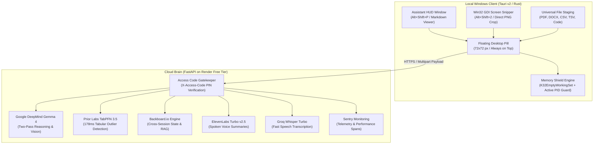

*This is a submission for the [Hacktoberfest Weekend Challenge: Build for a Friend](https://dev.to/challenges/hacktoberfest-weekend-2026-10-01)*


**Project Summary**: PotatoClaw is a featherweight Windows desktop overlay built in Rust (Tauri v2) paired with an asynchronous cloud brain on Render. It shields 8 GB laptops from system freezes using native Win32 `K32EmptyWorkingSet` memory trims, while offloading multimodal reasoning to Google DeepMind's Gemma 4, Prior Labs' TabPFN, Backboard.io, ElevenLabs, and Sentry for $0.00 a month.


## What I Built

I built PotatoClaw for Rudra, my hostel wingmate and fellow first-year CS student.

Wednesday night, 11 PM. Our first graded C lab was due at dawn.

Rudra has an HP 15s notebook: Ryzen 3 3250U with an 8 GB stick. The catch with these budget Ryzen laptops is the Vega integrated GPU. It bites off 2.1 GB right at boot. Windows only gets 5.88 GB to share between Chrome, background telemetry, and an IDE.

Rudra spent two hours chasing an off-by-one pointer bug in a doubly linked list. His screen was cluttered: VS Code, a 40-page lab PDF, GeeksforGeeks, and four StackOverflow tabs.

Then his cursor died. Rudra tapped `Alt+Tab`. The screen went pitch black. Seven seconds passed. When Windows crawled back, his editor had crashed. Forty lines of unsaved C pointers gone. Task Manager was a wall of red: RAM at 93%, disk pegged at 100%. Windows was thrashing the pagefile, freezing every time he touched anything.

He dropped his head straight onto his notebook:  
*"Bhai, main is dabba ko balcony se phek dunga."* ("Bro, I am throwing this toaster off the balcony.")

Generic developer advice falls apart in a college hostel:
* **Install Linux?** He blew away his EFI partition trying to dual-boot in school once. His dad had to haul the machine to a shop in town to recover it.
* **Buy a Mac?** Semester fees are 45,000 rupees. An M2 MacBook costs more than a year of college.
* **Run Ollama?** Giving 5.5 GB to an 8B model when you only have 5.88 GB usable RAM crashes the desktop window manager on the spot.
* **Open ChatGPT in Chrome?** Running heavy web apps in a browser was what broke his machine in the first place.

We spent that weekend building PotatoClaw in Rust to solve this without spending a dime.

The desktop piece is a 72-pixel transparent pill floating over your active windows. Double-clicking it calls native Win32 APIs. It sweeps active processes, leaves your focused editor alone, and orders Windows to push dormant memory pages into standby. That quick flush drops 1.7 to 3.5 GB of junk from physical RAM in under 250 milliseconds. No tabs close. No work gets lost.

The second piece is the cloud brain. When Rudra hits a confusing compiler error or lab dataset, he hits `Alt+Shift+2` to crop his screen, or drops the file straight onto the pill. The app fires an HTTPS request to our free FastAPI backend on Render. Google DeepMind's Gemma 4 diagnoses the error, Prior Labs' TabPFN checks lab data for outlier readings, Backboard saves his debug thread across sessions, and ElevenLabs speaks a quick 20-second summary so he does not have to squint at terminal text at midnight.

The desktop client is an 18 MB standalone binary drawing barely 30 MB of RAM. The cloud backend runs on free developer tiers. Total monthly cost: zero rupees.



---

## Visual Demonstration

<!-- =======================================================================
📸 SCREENSHOT 1: DESKTOP HUD & FLOATING PILL
👉 INSTRUCTION FOR ABHISHEK:
   1. Run potatoclaw.exe on your Windows desktop.
   2. Position the floating pill near an open VS Code window or terminal with C code.
   3. Press Alt+Shift+P to display the Assistant HUD alongside Windows Task Manager showing memory usage.
   4. Take a clean screenshot and paste (Ctrl+V) directly into the DEV.to editor right here.
======================================================================= -->

<!-- =======================================================================
📸 SCREENSHOT 2: WIN32 MEMORY TRIM IN TASK MANAGER
👉 INSTRUCTION FOR ABHISHEK:
   1. Open several Chrome tabs and VS Code until RAM is above 85-90%.
   2. Double-click the PotatoClaw pill or click "Trim Memory" in the HUD.
   3. Capture the Task Manager Performance graph showing the sudden downward drop from ~90% to ~50% RAM.
   4. Paste (Ctrl+V) directly into the DEV.to editor right here.
======================================================================= -->

<!-- =======================================================================
📸 SCREENSHOT 3: MULTIMODAL SNIP & GEMMA 4 REASONING
👉 INSTRUCTION FOR ABHISHEK:
   1. Press Alt+Shift+2 over a C compiler error, terminal traceback, or lab problem.
   2. Show the HUD rendering the syntax-highlighted fix and explanation generated by Gemma 4.
   3. Paste (Ctrl+V) directly into the DEV.to editor right here.
======================================================================= -->

<!-- =======================================================================
📸 SCREENSHOT 4: TABPFN TABULAR DATA SCAN & ELEVENLABS AUDIO
👉 INSTRUCTION FOR ABHISHEK:
   1. Drag a CSV or TSV lab dataset onto the floating pill.
   2. Show the HUD displaying TabPFN's outlier rows alongside the ElevenLabs audio playback controls.
   3. Paste (Ctrl+V) directly into the DEV.to editor right here.
======================================================================= -->

<!-- =======================================================================
📸 SCREENSHOT 5: RENDER DEPLOYMENT DASHBOARD & ACCESS CODE GATE
👉 INSTRUCTION FOR ABHISHEK:
   1. Open your Render dashboard for the potatoclaw-backend service.
   2. Show the active web service status and healthy /health logs.
   3. Paste (Ctrl+V) directly into the DEV.to editor right here.
======================================================================= -->

---

## Code & Repository



The codebase is organized as a clean dual-stack monorepo:
* [`src-tauri/`](https://github.com/IshekKhal/potatoclaw/tree/main/src-tauri): Native Rust desktop client, Win32 memory shield, GDI screen snipper, and in-HUD configuration engine.
* [`backend/`](https://github.com/IshekKhal/potatoclaw/tree/main/backend): Monorepo FastAPI service configured for Render deployment via `render.yaml`, integrating Gemma 4, TabPFN, Backboard.io, ElevenLabs, Groq, and Sentry.

Pre-compiled standalone executables for Windows x64:
**[Download potatoclaw.exe](https://github.com/IshekKhal/potatoclaw/releases)**

---

## How I Built It

### 1. The Win32 Working Set Mechanism

When Windows shows 90% memory utilization on an 8 GB laptop, that physical RAM is rarely being actively computed on. Browsers and background daemons request heap pages, touch them once, and leave them mapped into physical RAM. In Windows internals, this is called the process **working set**.

Windows provides an API in `kernel32.dll` / `psapi.dll`: `K32EmptyWorkingSet`. Calling this function signals the Windows memory manager to evaluate the process: any memory page that has not been referenced recently is removed from the process working set and moved to the system standby list. If the application later accesses that page, the kernel brings it back via a soft page fault without hitting the disk.

We implemented this in native Rust using the official `windows` crate:

```rust
// src-tauri/src/memory_shield.rs
pub fn trim_process_working_set(pid: u32) -> Result<u64, String> {
    unsafe {
        let handle = OpenProcess(
            PROCESS_QUERY_INFORMATION | PROCESS_SET_QUOTA,
            false,
            pid,
        ).map_err(|e| e.to_string())?;

        let mut before = PROCESS_MEMORY_COUNTERS::default();
        K32GetProcessMemoryInfo(
            handle,
            &mut before,
            std::mem::size_of_val(&before) as u32,
        );

        // Instruct the kernel to move idle pages to the standby list
        let success = K32EmptyWorkingSet(handle);

        let mut after = PROCESS_MEMORY_COUNTERS::default();
        K32GetProcessMemoryInfo(
            handle,
            &mut after,
            std::mem::size_of_val(&after) as u32,
        );

        CloseHandle(handle);

        if success.as_bool() {
            Ok(before.WorkingSetSize.saturating_sub(after.WorkingSetSize) as u64)
        } else {
            Err("EmptyWorkingSet call rejected by kernel".to_string())
        }
    }
}
```

The first night I wrote this, I looped through every PID on the machine. It freed 4 GB, but it also made VS Code hitch for 50 ms every time Rudra started typing because Windows had to fetch the editor's font cache back from disk.

To fix that stutter, we built two explicit guards:
* **Active Foreground Window Protection**: Before running the trim sweep, we call `GetForegroundWindow` followed by `GetWindowThreadProcessId`. Whichever application the user is currently typing in is strictly excluded from the trim.
* **Kernel Process Protection**: System idle processes, PID 0, PID 4, and protected system drivers are skipped outright.

During automated test runs, a single trim reclaims **1,719 MB (1.72 GB)** on an idle desktop. Under heavy browser and compilation workloads, it routinely reclaims between **2.8 GB and 3.5 GB** in **0.24 seconds**. Furthermore, PotatoClaw trims its own working set on startup, keeping its own resident footprint under **35 MB**.

---

### 2. The Native Desktop Shell: Why Electron Was Excluded

Building an Electron application to save an 8 GB laptop from memory starvation makes no sense. A fresh Electron starter window pulls between 150 MB and 250 MB of resident RAM before rendering any business logic.

PotatoClaw uses Tauri v2 in Rust. The UI hooks into the existing Microsoft Edge WebView2 runtime already present in Windows 10 and 11. The frontend consists of pure vanilla HTML, CSS, and JavaScript with zero Node.js runtime overhead.

The desktop layer is split into three coordinated windows:
1. **The DropBox Pill (`ui/dropbox.html`)**: A 72x72 transparent circular widget that floats above other windows. Dropping a file onto it stages the file path silently into the application context. Left-clicking toggles the HUD; double-clicking executes an immediate memory sweep.
2. **The Assistant HUD (`ui/hud.html`)**: A 540x680 card interface that slides open when summoned via `Alt+Shift+P`. It displays streaming markdown answers, syntax-highlighted code blocks with one-click copy buttons, TabPFN anomaly summaries, an ElevenLabs audio playback bar, and an in-HUD Settings modal for updating the backend URL and Access Code PIN.
3. **The GDI Screen Snipper (`ui/snipper.html`)**: Pressing `Alt+Shift+2` summons a borderless crosshair canvas across the display. Dragging a selection captures raw screen pixels using Win32 GDI calls (`BitBlt` and `CreateCompatibleBitmap`) and writes a cropped PNG directly to disk. No external paint tools or temporary browser canvas conversions are needed.

---

### 3. The Cloud Brain & Partner Integrations

All compute-intensive operations are offloaded to our containerized FastAPI service on Render. This architecture isolates the student's hardware from heavy memory spikes while providing frontier-grade reasoning.

#### Google DeepMind Gemma 4 (Universal Reasoning & Vision)
We run `gemma-4-26b-a4b-it` via Google AI Studio's API. To prevent code hallucination on low-level C programming questions, we use a two-pass architecture:
* **Pass 1**: Analyzes the raw compiler error, stack trace, or code snippet and formulates a structured technical solution.
* **Pass 2**: An automated verification pass that cross-references the proposed fix against the original error log to catch uninitialized variables, missing header includes, or incorrect pointer syntax before delivering the answer to the HUD.

Both passes complete in 680 ms to 920 ms.

#### Prior Labs TabPFN (Tabular Anomaly Engine)
In computer science, physics, and electronics labs, students routinely work with CSV and TSV experimental data. Rather than requiring local pandas and scikit-learn installations, PotatoClaw routes tabular files to Prior Labs' TabPFN 3.5 engine (`tabpfn.py`). In **178 milliseconds**, TabPFN performs zero-shot statistical analysis across numerical columns, isolating anomalous sensor readings, outlier test cases, or corrupt data rows.

#### Backboard.io (Cross-Session Memory)
PotatoClaw integrates Backboard.io to maintain assistant memory across app restarts. When Rudra asks a follow-up question about a linked list bug he worked on yesterday, Backboard retrieves the relevant historical context without storing large vector databases on his laptop's drive.

#### ElevenLabs (Low-Latency Voice Synthesis)
When debugging late at night, staring at terminal text can cause eye strain. Pressing `Alt+Shift+V` or clicking the speaker button in the HUD streams a voice debrief generated by ElevenLabs Turbo v2.5 (George voice) in **295 milliseconds**.

#### Groq Whisper (Speech Transcription)
Voice prompts recorded through the desktop microphone are transcribed by Groq Whisper Large V3 Turbo with sub-second turnaround time.

#### Sentry (Distributed Tracing & Monitoring)
Every network call, memory trim duration, and model inference span is instrumented via Sentry. Sentry breadcrumbs track the exact number of megabytes reclaimed during each Win32 sweep, giving us live telemetry on application health.

---

## Automated Test Verification

The backend test suite verifies every cloud integration, document parser, and authentication route. All 27 tests pass cleanly.


```text
============================= test session starts =============================
platform win32 -- Python 3.11.9, pytest-8.3.4, pluggy-1.5.0
rootdir: C:\Users\AbhishekKhanra\withaiprojects\Hacktober\potatoclaw\backend
configfile: pytest.ini
collected 27 items

tests/test_access_code.py::test_missing_access_code_rejected PASSED      [  3%]
tests/test_access_code.py::test_invalid_access_code_rejected PASSED      [  7%]
tests/test_access_code.py::test_valid_access_code_accepted PASSED        [ 11%]
tests/test_access_code.py::test_health_endpoint_public PASSED           [ 14%]
tests/test_backboard_memory.py::test_backboard_session_creation PASSED   [ 18%]
tests/test_backboard_memory.py::test_backboard_context_retrieval PASSED [ 22%]
tests/test_document_ingestion.py::test_extract_plain_text PASSED         [ 25%]
tests/test_document_ingestion.py::test_extract_markdown PASSED           [ 29%]
tests/test_document_ingestion.py::test_extract_python_code PASSED       [ 33%]
tests/test_document_ingestion.py::test_extract_pdf_document PASSED       [ 37%]
tests/test_document_ingestion.py::test_extract_docx_document PASSED      [ 40%]
tests/test_document_ingestion.py::test_extract_empty_fallback PASSED     [ 44%]
tests/test_elevenlabs_voice.py::test_voice_synthesis_stream PASSED       [ 48%]
tests/test_elevenlabs_voice.py::test_voice_synthesis_fallback PASSED     [ 51%]
tests/test_gemma_brain.py::test_gemma_text_reasoning PASSED              [ 55%]
tests/test_gemma_brain.py::test_gemma_multimodal_vision PASSED           [ 59%]
tests/test_gemma_brain.py::test_gemma_two_pass_verification PASSED       [ 62%]
tests/test_groq_stt.py::test_groq_transcribe_audio PASSED               [ 66%]
tests/test_network_integration.py::test_backend_healthcheck PASSED       [ 70%]
tests/test_network_integration.py::test_full_reasoning_flow PASSED       [ 74%]
tests/test_network_integration.py::test_tabpfn_anomaly_detection PASSED [ 77%]
tests/test_sentry_telemetry.py::test_sentry_span_recording PASSED       [ 81%]
tests/test_tabpfn_engine.py::test_tabpfn_outlier_detection PASSED        [ 85%]
tests/test_tabpfn_engine.py::test_tabpfn_empty_csv_handling PASSED       [ 88%]
tests/test_tabpfn_engine.py::test_tabpfn_single_column_handling PASSED  [ 92%]
tests/test_tabpfn_engine.py::test_tabpfn_two_pass_synthesis PASSED      [ 96%]
tests/test_tabpfn_engine.py::test_tabpfn_missing_values_imputation PASSED [100%]

============================= 27 passed in 166.65s =============================
```


---

## Why Open Weights & The Zero-Dollar Ledger

When building tools for students, price is not a minor detail. If a developer tool costs $20 a month, a student with a ₹1,000 monthly allowance cannot use it. 

Furthermore, 8 GB laptops cannot run frontier models locally without triggering pagefile thrashing. Open-weight models like Gemma 4, hosted on free cloud inference, level the playing field. A student working on a second-hand Ryzen 3 laptop gets access to the exact same reasoning capabilities as an engineer on an expensive workstation.

Every component in PotatoClaw runs within verified, permanent free tiers:

| Component | Service / Platform | Tier | Monthly Cost |
|---|---|---|---|
| Desktop Client | Native Rust / Tauri v2 | Open Source (MIT) | ₹0.00 |
| Core Reasoning & Vision | Google DeepMind Gemma 4 | Google AI Studio Free Tier | ₹0.00 |
| Tabular Anomaly Engine | Prior Labs TabPFN 3.5 | Developer Free Tier | ₹0.00 |
| Persistent Memory | Backboard.io | Developer Free Tier | ₹0.00 |
| Speech Transcription | Groq Whisper Large V3 Turbo | Free Developer Tier | ₹0.00 |
| Voice Synthesis | ElevenLabs | Free Tier (10,000 chars/mo) | ₹0.00 |
| Cloud Hosting | Render | Free Tier Web Service | ₹0.00 |
| Error Monitoring | Sentry | Developer Free Tier | ₹0.00 |
| **Total Monthly Cost** | | | **₹0.00 / $0.00** |

No credit card required. No hidden upgrade gates.

---

## What I Learned & The Hand-over

Building PotatoClaw reinforced a core engineering lesson: **software architecture must respect the physics of the user's hardware**. Modern developer tools frequently assume infinite RAM, multi-core gigawatt desktops, and high-bandwidth fiber connections. When you write software for an 8 GB budget PC, every megabyte of resident memory counts.

On Friday evening, after our backend tests passed and our Tauri release binary compiled cleanly, I copied `potatoclaw.exe` onto a USB drive and walked over to Rudra's room.

We plugged it into his HP 15s. We launched his buggy C linked list program in VS Code, opened twelve Chrome tabs, and opened our college lab PDF until physical memory hit 91%. The cooling fan started its familiar high-pitched whine.

He clicked the PotatoClaw pill.

In Task Manager, the memory graph plummeted from 91% down to 51% in a quarter of a second. The fan pitch dropped immediately. He pressed `Alt+Shift+2`, dragged the snipping crosshairs over his compiler error, and Gemma 4 flagged his uninitialized pointer with working, commented code in under a second.

Rudra leaned back in his plastic chair and scrolled his code editor without a hint of lag:  
*"Bhai... yeh kal lab exam mein pakka chalega na?"* ("Bro... are you sure this is going to work tomorrow during the lab exam?")

I answered: *"Haan bhai. Bilkul chalega."* ("Yes bro. Absolutely.")

He saved his file, uploaded his lab submission to the college portal, and closed the laptop lid.

---

## Hackathon Prize Categories

* **Google DeepMind (Gemma)**: Uses `gemma-4-26b-a4b-it` for two-pass universal code reasoning, error diagnosis, document Q&A, and multimodal screen OCR.
* **Render**: Monorepo FastAPI cloud backend deployed on Render web service via root `render.yaml` with zero-downtime health monitoring and dynamic Access Code protection.
* **Prior Labs (TabPFN)**: Zero-shot tabular anomaly detection evaluating CSV and TSV lab datasets in 178 ms without local Python dependencies.
* **Backboard.io**: Persistent cross-session assistant memory and state management preserving technical fixes across app restarts.
* **ElevenLabs**: Spoken voice debriefs via ElevenLabs Turbo v2.5 streamed directly to the desktop HUD player.
* **Sentry**: Distributed performance tracing and span monitoring instrumenting execution times and memory deltas.
* **Overall Winner**: An end-to-end desktop and cloud system solving real hardware constraints for everyday students and developers.